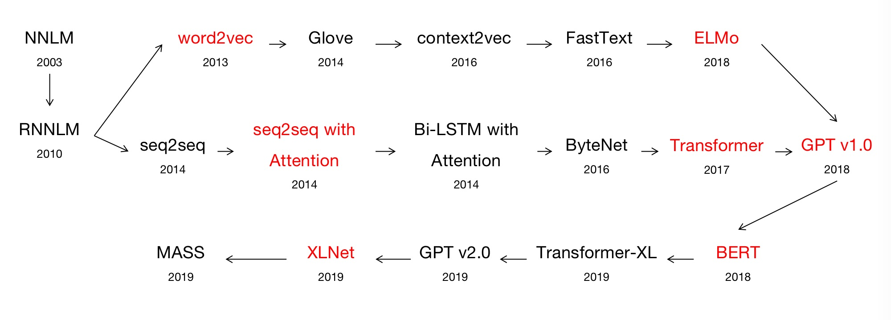

# Paper Reading with Code

## Text Embedding
| # | Title | KeyPoints | Conference/Publication | Implementation | Notes|
|:---:| :-----: | :---------:| :-----------:| :---------:| :--------------------: |
| 1 | [Efficient Estimation of Word Representations in Vector Space](https://arxiv.org/pdf/1301.3781.pdf)|Word2Vec

静态WordEmbedding CBOW SkipGram WordEmbedding是主产品 无法区分多义词的不同语义
| ICLR Workshop 2013 | [TensorFlow]() [Pytorch]() | [Note]()  |
| 2 | [GloVe: Global Vectors for Word Representation](https://www.aclweb.org/anthology/D14-1162) |GloVe

| EMNLP 2014 | [TensorFlow]() [Pytorch]() | [Note]()  |
| 3 | [Skip-Thought Vectors](https://papers.nips.cc/paper/5950-skip-thought-vectors.pdf) |Skip-Thought

| NIPS 2015 | [TensorFlow]() [Pytorch]() | [Note]()  |
| 4 | [An efficient framework for learning sentence representations](https://arxiv.org/pdf/1803.02893.pdf) |Quick-Thought

| ICLR 2018 | [TensorFlow]() [Pytorch]() | [Note]()  |
| 5 | [context2vec:Learning Generic Context Embedding with Bidirectional LSTM](https://www.aclweb.org/anthology/K16-1006) |Context2Vec

| CoNLL 2016 | [TensorFlow]() [Pytorch]() | [Note]()  |
| 6 | [Distributed Representations of Sentences and Documents](https://arxiv.org/pdf/1405.4053.pdf) |Doc2Vec

| PMLR 2014 | [TensorFlow]() [Pytorch]() | [Note]()  |

## Graph Embedding
| # | Title | KeyPoints | Conference/Publication | Implementation | Notes|
|:---:| :-----: | :---------:| :-----------:| :---------:| :--------------------: |
| 1 | [DeepWalk: Online Learning of Social Representations](https://arxiv.org/pdf/1403.6652.pdf) |DeepWalk

| KDD 2014 | [TensorFlow]() [Pytorch]() | [Note]()  |
| 2 | [node2vec: Scalable Feature Learning for Networks](https://cs.stanford.edu/~jure/pubs/node2vec-kdd16.pdf) |Node2Vec

| KDD 2016 | [TensorFlow]() [Pytorch]() | [Note]()  |
| 3 | [LINE: Large-scale Information Network Embedding](https://arxiv.org/pdf/1503.03578.pdf) |LINE

| WWW 2015 | [TensorFlow]() [Pytorch]() | [Note]()  |
| 4 | [Translating Embeddings for Modeling Multi-relational Data](https://papers.nips.cc/paper/5071-translating-embeddings-for-modeling-multi-relational-data.pdf) |TransE

| NIPS 2013 | [TensorFlow]() [Pytorch]() | [Note]()  |

# Pre-trained Language Model

    

| # | Title | KeyPoints | Conference/Publication | Implementation | Notes|
|:---:| :-----: | :---------:| :-----------:| :---------:| :--------------------: |
| 1 | [A Neural Probabilistic Language Model](http://www.jmlr.org/papers/volume3/bengio03a/bengio03a.pdf) |NNLM

静态WordEmbedding 给定上文单词 预测当前单词 WordEmbedding是副产品
| JMLR 2003 | [TensorFlow]() [Pytorch]() | [Note]()  |
| 2 | [Recurrent neural network based language model](https://www.fit.vutbr.cz/research/groups/speech/publi/2010/mikolov_interspeech2010_IS100722.pdf) [Slides](http://www.fit.vutbr.cz/research/groups/speech/servite/2010/rnnlm_mikolov.pdf) |RNNLM

| INTERSPEECH 2010 | [TensorFlow]() [Pytorch]() | [Note]()  |
| 3 | [Deep contextualized word representations](https://arxiv.org/pdf/1802.05365.pdf) |ELMO

| NAACL 2018 | [TensorFlow]() [Pytorch]() | [Note]()  |
| 4 | [Improving Language Understanding by Generative Pre-Training](https://s3-us-west-2.amazonaws.com/openai-assets/research-covers/language-unsupervised/language_understanding_paper.pdf) |GPT1.0

基于Fine-Tuning的预训练方法 与word2vec不同点在于：word2vec在fine-tuning过程中，只调整embedding矩阵而不调整网络结构，而GPT的网络结构参数也参与到Fine-Tuning过程中 典型的两阶段过程 第一阶段利用语言模型进行预训练,第二阶段通过Fine-Tuning的模式解决下游任务 特征抽取器采用Transformer 仅采用单向的语言模型 GPT的使用: 需要将下游任务的网络结构改造成与GPT网络结构相同，然后使用预训练的参数初始化网络，并结合下游任务进行Fine-Tuing,以使得网络结构更加适合下游任务 finetuning时，通常在其后加入一个线性层，而不再接入复杂的网络
| INTERSPEECH 2018 | [TensorFlow]() [Pytorch]() | [Note]()  |
| 5 | [BERT: Pre-training of Deep Bidirectional Transformers for Language Understanding](https://arxiv.org/pdf/1810.04805.pdf)|BERT

BERT(Bidirectional Encode Representations from Transformer)最关键有两点:特征抽取器采用Transformer;采用双向语言模型进行预训练 BERT与GPT及ELMO的对比:如果把ELMO的特征抽取器换成Transformer，那么就得到了BERT;如果把GPT的预训练阶段换成双向语言模型，就得到了BERT。
| INTERSPEECH 2018 | [TensorFlow]() [Pytorch]() | [Note]()  |
| 6 | [Transformer-XL: Attentive Language Models Beyond a Fixed-Length Context](https://arxiv.org/pdf/1901.02860.pdf) |Transformer-XL

| ACL 2019 | [TensorFlow]() [Pytorch]() | [Note]()  |
| 7 | [Language Models are Unsupervised Multitask Learners](https://d4mucfpksywv.cloudfront.net/better-language-models/language-models.pdf) [Slides](https://pdfs.semanticscholar.org/41f9/45f59bd0d345d4e355fb72110524f6fdffdb.pdf) |GPT 2.0

|  OpenAI 2019 | [TensorFlow]() [Pytorch]() | [Note]()  |
| 8 | [ERNIE: Enhanced Language Representation with Informative Entities](https://arxiv.org/pdf/1905.07129.pdf) |ERNIE(Tsinghua)

| ACL 2019 | [TensorFlow]() [Pytorch]() | [Note]()  |
| 9 | [ERNIE: Enhanced Representation through Knowledge Integration](https://arxiv.org/pdf/1904.09223.pdf) |ERNIE(Baidu)

| arXiv 2019 | [TensorFlow]() [Pytorch]() | [Note]()  |
| 10 | [ERNIE 2.0: A Continual Pre-Training Framework for Language Understanding](https://arxiv.org/pdf/1907.12412.pdf) |ERNIE 2.0(Baidu)

| AAAI 2020 | [TensorFlow]() [Pytorch]() | [Note]()  |
| 11 | [MASS: Masked Sequence to Sequence Pre-training for Language Generation](https://arxiv.org/pdf/1905.02450.pdf) |MASS

| ICML  2019 | [Pytorch](https://github.com/microsoft/MASS) | [Note]()  |
| 12 | [Unified Language Model Pre-training for Natural Language Understanding and Generation](https://arxiv.org/pdf/1905.03197.pdf)|UniLM

| arXiv 2019 | [Pytorch](https://github.com/microsoft/unilm) | [Note]()  |
| 13 | [XLNet: Generalized Autoregressive Pretraining for Language Understanding](https://arxiv.org/pdf/1906.08237.pdf) |XLNet

| NIPS 2019 | [TensorFlow]() [Pytorch]() | [Note]()  |
| 14 | [ALBERT: A LITE BERT FOR SELF-SUPERVISED LEARNING OF LANGUAGE REPRESENTATIONS](https://arxiv.org/pdf/1909.11942.pdf) |ALBERT

| ICLR  2020 | [TensorFlow](https://github.com/google-research/ALBERT)| [Note]()  |

# Seq2Seq
| # | Title | KeyPoints | Conference/Publication | Implementation | Notes|
|:---:| :-----: | :---------:| :-----------:| :---------:| :--------------------: |
| 1 | [Learning Phrase Representations using RNN Encoder–Decoder for Statistical Machine Translation](https://www.aclweb.org/anthology/D14-1179)|Seq2Seq| EMNLP 2014 | [TensorFlow]() [Pytorch]() | [Note]()  |
| 2 | [Sequence to Sequence Learning with Neural Networks](https://papers.nips.cc/paper/5346-sequence-to-sequence-learning-with-neural-networks.pdf)|Seq2Seq| NIPS 2014 | [TensorFlow]() [Pytorch]() | [Note]()  |
| 3 | [Neural Machine Translation by Jointly Learning to Align and Translate](https://arxiv.org/pdf/1409.0473.pdf)|Seq2Seq with Attention| EMNLP 2014 | [TensorFlow]() [Pytorch]() | [Note]()  |
| 4 | [Attention-Based Bidirectional Long Short-Term Memory Networks for Relation Classification](https://www.aclweb.org/anthology/P16-2034)|BiLSTM with Attention| ACL 2016 | [TensorFlow]() [Pytorch]() | [Note]()  |
| 5 | [Neural Machine Translation in Linear Time](https://arxiv.org/pdf/1610.10099v1.pdf) [Slides](http://llcao.net/cu-deeplearning17/pp/class8_TranslationinLinearTime.pdf)|ByteNet| Computation and Language 2016 | [TensorFlow]() [Pytorch]() | [Note]()  |
| 6 | [Attention Is All You Need](https://papers.nips.cc/paper/7181-attention-is-all-you-need.pdf)|Transformer| NIPS 2017 | [TensorFlow]() [Pytorch]() | [Note]()  |
| 7 | [End-to-end Sequence Labeling via Bi-directional LSTM-CNNs-CRF](https://arxiv.org/pdf/1603.01354.pdf)|CNN-BiLSTM-CRF

| ACL 2016 | [TensorFlow]() [Pytorch]() | [Note]()  |
| 8 | [Chinese NER Using Lattice LSTM](https://www.aclweb.org/anthology/P18-1144.pdf)|Lattice LSTM

| ACL 2018 | [TensorFlow]() [Pytorch]() | [Note]()  |

## Text Classification
| # | Title | KeyPoints | Conference/Publication | Implementation | Notes|
|:---:| :-----: | :---------:| :-----------:| :---------:| :--------------------: |
| 1 | [Bag of Tricks for Efficient Text Classification](https://arxiv.org/pdf/1607.01759.pdf)|FastText

| EACL 2017 | [TensorFlow]() [Pytorch]() | [Note]()  |
| 2 | [Hierarchical Attention Networks for Document Classification](https://www.cs.cmu.edu/~./hovy/papers/16HLT-hierarchical-attention-networks.pdf) | 

Hierarchical Attention
| ACL 2016 | [TensorFlow]() [Pytorch]() | [Note]()  |

## Graph Neural Network
| # | Title | KeyPoints | Conference/Publication | Implementation | Notes|
|:---:| :-----: | :---------:| :-----------:| :---------:| :--------------------: |
| 1 | [Graph Neural Networks: A Review of Methods and Applications](https://arxiv.org/pdf/1812.08434.pdf)|Survey

| arXiv 2018 |  | [Note]()  |